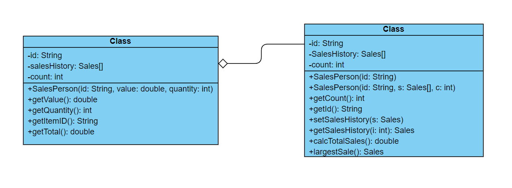
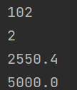

# OOP Forum Week 9

## Number 1

**(a.) By making use of an example from the above scenario, distinguish between a class and an instantiation of a class.**

A class is a template or blueprint from which individual objects are created, while an instantiation of a class is when an object is created. For example, in this scenario, the manager role is a class and it acts as a template, and in it, it contains the object which can contain the manager’s name, address, etc.

**(b.) By giving two examples, explain how the principles of inheritance can be incorporated into the design of this administration program.**

Inheritance can be incorporated in many ways. First example, we can have a workers class that contains all the details of the employees working such as the manager, salesperson, etc. Another way is that we make another class for the products, which can have the prices or groupings of each product.

**(c.) Describe how the use of libraries can facilitate the development of programs like this company’s administration program.**

Using libraries accelerates the development of programs like these because libraries already come with predetermined classes, so it can reduce the work needed as we don’t need to make a linked list manually for example.

## Number 2

**(a.) Complete the constructor public SalesPerson(String id), from the SalesPerson class.**

*In the SalesPerson Class*

**(b.) Explain why accessor methods are necessary for the SalesPerson class.**

Accessor methods are necessary for the Salesperson class because it is used to access attributes that are private, so it can’t be changed outside of its own class.

**(c.)(i.) Construct unified modelling language (UML) diagrams to clearly show the relationship between the SalesPerson and Sales classes.**

**(c.)(ii.) Outline a negative effect that a future change in the design of the Sales object might have on this suite of programs.**

If a change is needed, there will be no way to do it, because we need to update everything else so it can work with the Sales class.

**(d.) State the output after running this code.**

**(e.) Construct the method calcTotalSales(), in the SalesPerson class that calculates the total value of the sales for a specific SalesPerson object.**

*In the SalesPerson class*

**(f.) By making use of any previously written methods, construct the method highest() that returns the ID of the salesperson whose sales have the largest total value.**

*In the Driver class*

**(g.) Construct the method addSales(Sales s, String id), in the Driver class, that will add a new Sales object s, to the salesperson with a specified ID.**

*In the Driver class*

**(h.) Suggest changes that must be made to the SalesPerson class and/or the Sales class to allow these calculations to be made.**

A date variable should be added, it would also require getters and setters.

**(i.) Discuss the use of polymorphism that occurs in this suite of programs.**

The polymorphism in this program occurs in the SalesPerson class, where it has overloading because of the 2 constructors in the class.
